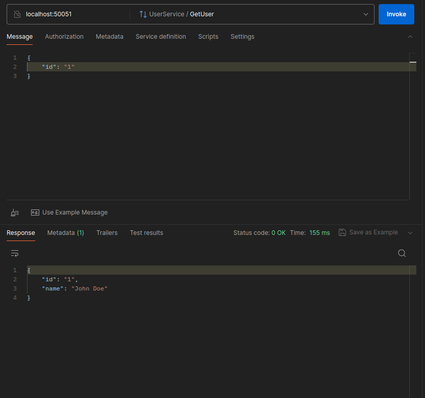
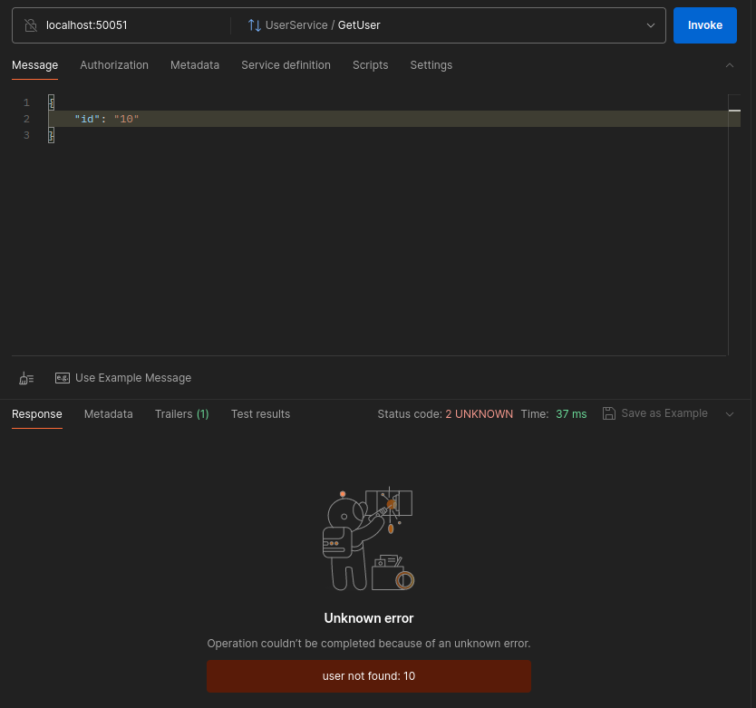
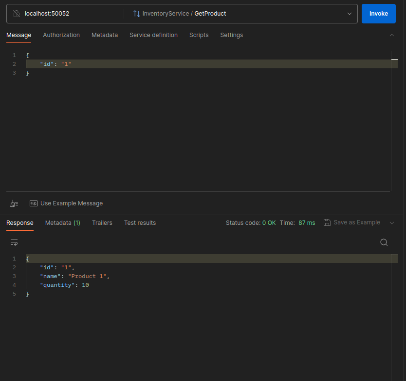
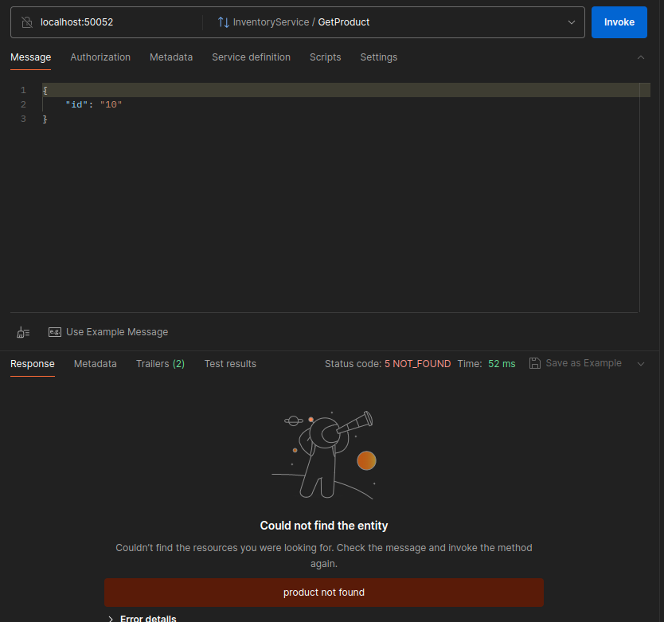
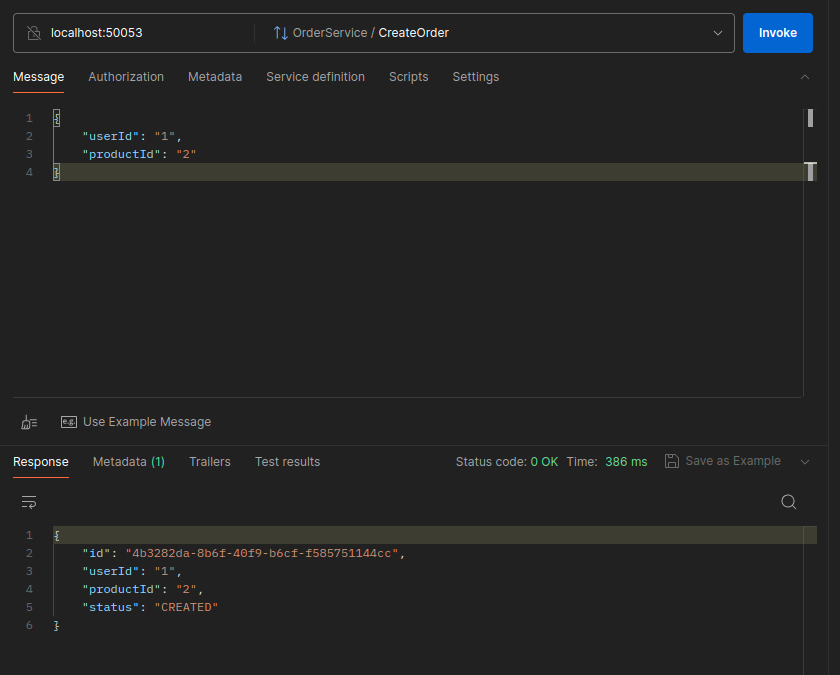
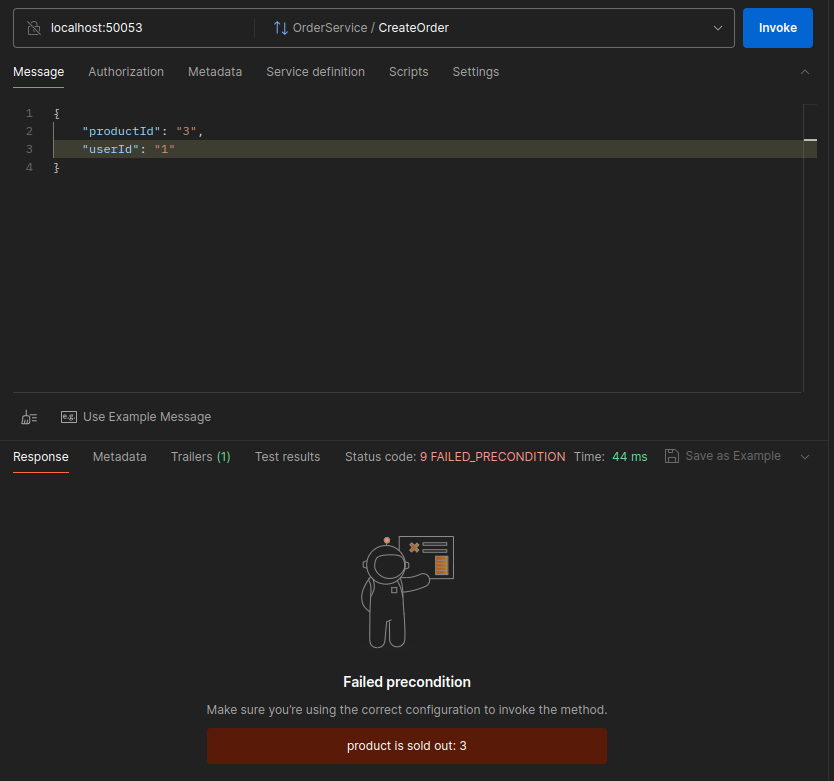

# go-grpc-microservices

A simplified demo of three Go microservices communicating via gRPC,
implemented in ***monorepo*** code storage concept.

In this project creating a request by passing the user id and product id
is simulated.

**Caution**: the main focus of this project is the gRPC and
communication between the tree microservices. 

# Index

* [Commands](#commands)
    * [Bring up the application](#bring-up-the-application)
    * [Bring down the application](#release-the-docker-resources)
* [Project Structure](#project-structure)
* [Services overview](#services-overview)

## Commands

This project uses docker to manage the dependencies,
so you can use the make commands to have the project
up and running as it should be.

### Bring up the application

You can up the docker environment using this command.
by running this command a built version will be created
for each service, and you can connect to the services through
the ports using gRPC.

```shell
make up
```

Default service ports are as following:

Service|Port
---|---
User|50051
Inventory|50052
Order|50053

### Release the docker resources

You can bring down the running project docker environment
by this command.

```shell
make down
```

## Project Structure

You can take a brief view of the project strucutre in here.

```shell
.
├── .assets # readme file assets
│   ├── create-order-invalid-product-error.png
│   ├── create-order.png
│   ├── create-order-sold-out-error.png
│   ├── get-product-not-found-error.png
│   ├── get-product.png
│   ├── get-user-not-found-error.png
│   └── get-user.png
├── cmd # applications
│   ├── inventoryservice
│   │   └── main.go
│   ├── orderservice
│   │   └── main.go
│   └── userservice
│       └── main.go
├── config
│   ├── config.yaml # default configs
│   ├── loader.go
│   └── structs.go
├── .docker # project docker images
│   ├── Dockerfile
│   └── prod.Dockerfile
├── docker-compose.yml
├── .env
├── .env.example
├── .gitignore
├── go.mod
├── go.sum
├── internal # the applications
│   ├── inventory
│   │   ├── errors.go
│   │   ├── server.go
│   │   ├── server_integration_test.go
│   │   └── server_test.go
│   ├── order
│   │   ├── errors.go
│   │   ├── server.go
│   │   ├── server_integration_test.go
│   │   └── server_test.go
│   ├── providers.go
│   ├── user
│   │   ├── errors.go
│   │   ├── server.go
│   │   ├── server_integration_test.go
│   │   └── server_test.go
│   ├── wire_gen.go
│   └── wire.go
├── LICENSE
├── logs # log files (separated by day)
│   ├── app-2025-11-24.log
│   ├── app-2025-11-27.log
│   ├── app-2025-11-28.log
│   └── .gitignore
├── Makefile # make commands
├── pkg # shared packages between different applications
│   ├── app
│   │   └── info.go
│   ├── applog
│   │   └── logger.go
│   ├── proto
│   │   ├── services_grpc.pb.go # generated by protoc
│   │   ├── services.pb.go # generated by protoc
│   │   └── services.proto # the services proto file
│   └── request
│       ├── context.go
│       └── middlewares.go
└── README.md

17 directories, 42 files
```

# Services Overview

You can see a brief view of the services using pictures.

### Get User By ID



#### Not Found User



### Get Product By ID



#### Not Found Product



### Create Order



#### Not Found Product For The Order (Invalid Product)


#### Sold Out Product


